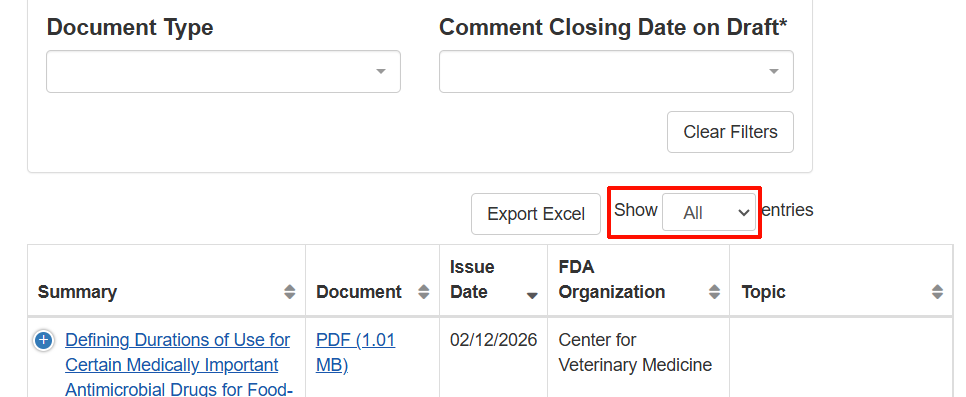
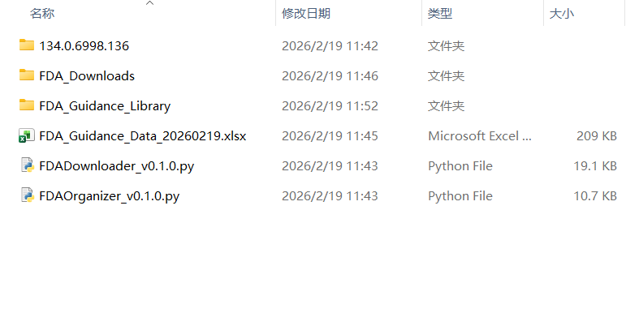
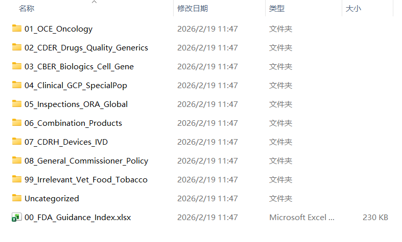

# **FDA指导原则自动化下载与整理工具**

这是一个基于 Python 的自动化工具集，用于从 FDA 官网抓取、下载指导原则，并根据特定的业务逻辑将其整理归档到分类文件夹中。

本项目包含两个核心脚本：

1. **FDADownloader.py**: 负责从 FDA 网站抓取元数据、导出 Excel 并下载文件。  
2. **FDAOrganizer.py**: 负责读取下载的数据，按预设规则将文件分类整理到结构化目录，并生成带索引的 Excel。

## **🛠 功能特性**

* **智能浏览器控制**: 使用 Selenium 自动化控制 Chrome，支持自动检测本地 Chrome 路径及版本。  
* **断点续传/去重**: 自动检测本地已下载文件，避免重复下载；支持读取本地 Excel 继续未完成的任务。  
* **规避反爬**: 模拟真实用户行为，使用浏览器原生下载功能，有效规避 FDA 网站的反爬虫机制。  
* **规范化命名**: 下载的文件自动重命名为 YYYYMMDD_Summary 格式，便于排序和检索。  
* **智能分类归档**: 根据 FDA 组织架构（如 CBER、CDER、CDRH）及关键词（如 Oncology、GCP）将文件自动整理到不同文件夹。  
* **本地索引生成**: 整理完成后生成一份包含本地文件超链接的 Excel 索引表，点击即可直接打开文件。

## **⚙️ 环境依赖**

需要安装 Python 3.8+ 及 Google Chrome 浏览器。

### **安装 Python 库**

请在项目根目录下运行：

```
pip install \-r requirements.txt
```

*或者手动安装以下库：* selenium, pandas, beautifulsoup4, tqdm, openpyxl, webdriver-manager

## **🚀 使用指南**

### **第一步：下载数据 (FDADownloader.py)**

该脚本负责抓取列表并下载源文件。

```
python FDADownloader.py
```

可选参数：

```
python FDADownloader.py --url https://www.fda.gov/regulatory-information/search-fda-guidance-documents --download-dir FDA_Downloads
```

**运行流程与注意事项：**

1. **启动浏览器**: 脚本会自动打开 Chrome 窗口。  
2. **手动筛选 (重要)**:  
   * 控制台会提示 【请配合手动操作】。  
   * 在自动打开的浏览器窗口中，请在 FDA 网页的 Filters 栏选择需要的筛选条件（如有）。  
   * **关键步骤**：请务必将显示条数设置为 **"Show All"**，并等待页面刷新，确保所有数据都已加载。
     <div align="center">  </div>
3. **确认抓取**: 页面加载完毕后，在控制台按 Enter 键。  
4. **导出 Excel**: 程序会解析表格并生成 FDA\_Guidance\_Data\_YYYYMMDD.xlsx。  
5. **开始下载**: 程序会询问是否开始下载，输入 y 确认。浏览器将逐个下载文件并重命名存入 FDA_Downloads 文件夹。

### **第二步：整理归档 (FDAOrganizer.py)**

该脚本负责将下载的一锅粥文件整理成结构化的文件夹。

```
python FDAOrganizer.py
```

可选参数：

```
python FDAOrganizer.py --excel FDA_Guidance_Data_20260529.xlsx --source FDA_Downloads --target FDA_Guidance_Library --rules classification_rules.csv
```

**运行流程：**

1. 自动扫描当前目录下最新的 FDA\_Guidance\_Data\_YYYYMMDD.xlsx 文件。  
2. 读取 FDA\_Downloads 文件夹中的源文件。  
3. 根据内置的优先级规则，将文件**复制**到 FDA\_Guidance\_Library 目录下的分类子文件夹中。  
4. 在 FDA\_Guidance\_Library 根目录生成 00\_FDA\_Guidance\_Index.xlsx，其中包含指向整理后文件的本地超链接。

## **📂 目录结构示例**

运行完成后，你的目录结构将如下所示：

<div align="center">  </div>

<div align="center">  </div>

## **🧠 分类逻辑说明**

FDAOrganizer.py 采用基于优先级的关键词匹配策略。文件会按照以下逻辑进行归类（一旦匹配成功即停止）：

分类规则默认读取项目根目录下的 `classification_rules.csv`。该文件按从上到下的顺序匹配 `Keyword`，并将命中的文件归入对应的 `Folder`；如需调整优先级或新增分类，直接编辑该 CSV 即可。

1. **最优先**: 本人主要做肿瘤产品，因此肿瘤相关的文件拥有最高优先级，只要沾边就归入 01_OCE_Oncology。
2. **第二层 - 药械组合（Combination）**: 这部分往往容易被淹没在 CDRH 或 CDER 里，但对预充针/自动注射笔开发至关重要，所以提级处理。  
3. **第三层 - 跨中心功能模块**: GCP、核查（Inspection）、行政程序等通用文件，不再按中心分割，全部聚合在一起。  
4. **核心层**:  剩下的文件按 CDER (药) > CBER (生物) > CDRH (器械) 的顺序归位。 

## **⚠️ 常见问题**

1. **浏览器闪退或无法启动**：  
   * 确保已安装 Chrome。  
   * 脚本支持自动检测路径，但如果你的 Chrome 安装在非常规位置，请按照脚本启动时的提示手动输入 chrome.exe 的路径。  
2. **下载速度慢**：  
   * 为了防止 IP 被 FDA 封锁，脚本在下载文件之间设置了随机延时。  
   * 下载是串行进行的（单线程），这是为了保证文件重命名的准确性。  
3. **Excel 写入报错**：  
   * 请确保在运行脚本时，目标 Excel 文件没有被其他软件（如 WPS/Office）打开。

## **免责声明**

本工具仅供学习和个人研究使用。请遵守 FDA 网站的使用条款及 robots.txt 协议。请勿高频滥用以免对目标服务器造成压力。
